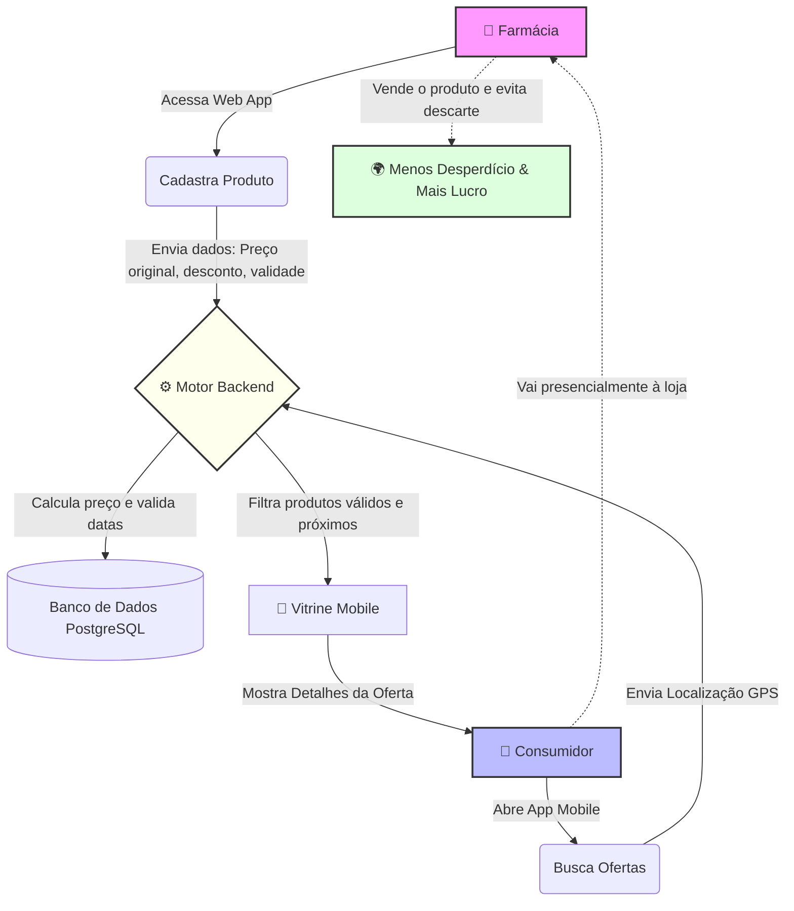
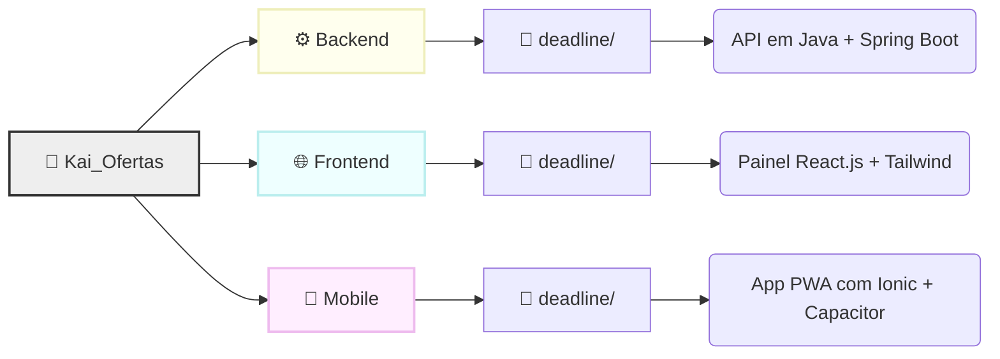

# **🕒 Projeto Kai Ofertas**

<p align="center">
  
  
  
  
  
</p>

## **🎯 Sobre o Projeto**

No setor farmacêutico, o desperdício de produtos por vencimento é um problema financeiro e regulatório grave, gerando o custo da perda do produto e a taxa de descarte especializado.

O **Kai Ofertas** atua como uma vitrine inteligente para resolver este problema. A plataforma transforma um passivo (produto a ser descartado) em fluxo de caixa, atraindo clientes para a loja física e promovendo o acesso mais barato a itens de saúde, dermocosméticos e higiene para a população.

---

## **📱 Aplicações e Ecossistema**

O projeto Kai Ofertas possui um ecossistema completo dividido em três partes principais:

### 1. 🌐 Web App (Painel Administrativo para Empresas)
**Acesse o site oficial:** [https://synapse-deadline.vercel.app/](https://synapse-deadline.vercel.app/)  
O ambiente web foi desenhado para as Farmácias e Drogarias. É onde o gerente realiza o cadastro rápido das ofertas de produtos próximos ao vencimento, com um painel (dashboard) prático construído com **React.js e Tailwind CSS**.

### 2. 📱 App Mobile (Aplicativo para Consumidores)
**📦 Download do APK:** Para usar o aplicativo no seu dispositivo Android e encontrar as melhores ofertas próximas a você, acesse a nossa [**página de Releases**](https://github.com/davifreitas/Synapse_Deadline/releases) e baixe a versão `.apk` mais recente.  
O app foi desenvolvido com foco na agilidade e proximidade. Feito com **React e Ionic Capacitor**, entregando uma experiência nativa focada em geolocalização.

### 3. ⚙️ Backend (API e Motor de Regras)
O cérebro da operação. Desenvolvido em **Java com Spring Boot** e banco de dados **PostgreSQL**. A API garante a consistência das regras de negócio (como desativar ofertas já vencidas automaticamente), cálculos de preços e a união entre a farmácia e o consumidor.

---

## **🔄 Como o Kai Ofertas Funciona (Fluxo Principal)**

Para entender o modelo de negócios e o papel de cada aplicação, veja o diagrama de fluxo abaixo:



---

## **📊 Funcionalidades: Web App vs Mobile App**

Aqui está uma comparação mostrando o que cada ponta do sistema é capaz de fazer:

| Funcionalidade | 🌐 Painel Web (Empresas) | 📱 App Mobile (Consumidores) |
|---|:---:|:---:|
| **Cadastro de Conta e Login** | ✔️ *(Acesso restrito para gerentes)* | ❌ *(Acesso livre para uso rápido)* |
| **Cadastro Ágil de Produtos** | ✔️ *(Insere validade e desconto)* | ❌ |
| **Visualização da Vitrine** | ❌ | ✔️ *(Com foco na geolocalização)* |
| **Cálculo Automático de Preços** | ✔️ *(O lojista só informa o % desconto)* | ❌ |
| **Filtros (Distância, Validade, Preço)** | ❌ | ✔️ |
| **Mapa e Ordenação por Distância** | ❌ | ✔️ |
| **Ocultação de Itens Vencidos** | ✔️ *(Gerente acompanha no histórico)* | ✔️ *(Itens vencidos somem da vitrine)* |
| **Compra e Pagamento in-app** | ❌ *(Transação no balcão)* | ❌ *(Reserva e compra presencial)* |

---

## **📂 Estrutura de Pastas do Projeto**

Para facilitar a contribuição e manutenção, o repositório está estruturado em monorepo (múltiplas aplicações no mesmo lugar):



---

## **🚀 Como Usar e Instalar Localmente**

Para rodar este ecossistema completo na sua máquina, siga o passo a passo de cada módulo:

### **Pré-requisitos**
- [Node.js](https://nodejs.org/en/) (v20+)
- [Java 17](https://jdk.java.net/17/) (ou superior) e [Maven](https://maven.apache.org/)
- Banco de Dados [PostgreSQL](https://www.postgresql.org/)
- (Opcional) Android Studio para compilação nativa

### **⚙️ 1. Backend (API)**
1. Navegue até a pasta do backend:
   ```bash
   cd Backend/deadline
   ```
2. Configure o banco de dados. Crie um banco PostgreSQL, copie o arquivo `.env.example` e renomeie para `.env` colocando suas credenciais:
   ```bash
   cp .env.example .env
   ```
3. Inicie o servidor via Maven:
   ```bash
   ./mvnw spring-boot:run
   ```
   > A API estará disponível em `http://localhost:8080`.

### **🌐 2. Frontend (Painel Web)**
1. Em um novo terminal, navegue até a pasta do frontend:
   ```bash
   cd Frontend/deadline
   ```
2. Instale as dependências:
   ```bash
   npm install
   ```
3. Configure as variáveis de ambiente (use `.env.example` como base).
4. Rode a aplicação em modo de desenvolvimento:
   ```bash
   npm run dev
   ```
   > O site da empresa ficará acessível em `http://localhost:5173`.

### **📱 3. Mobile (App Ionic)**
1. Em outro terminal, vá até a pasta mobile:
   ```bash
   cd Mobile/deadline
   ```
2. Instale as dependências:
   ```bash
   npm install
   ```
3. Crie e ajuste seu `.env` com a URL do Backend (ex: `http://localhost:8080` para emulador web ou o IP da rede local para teste físico).
4. Para visualizar o app no navegador:
   ```bash
   npm run dev
   ```
5. **Para buildar o APK (Android)**:
   ```bash
   npm run build
   npx cap sync android
   npx cap open android
   ```
   > O Android Studio será aberto e de lá você pode gerar seu `.apk` final.

---

## **🧠 Regras de Negócio Fundamentais**
1. **Vínculo Obrigatório**: Todo produto existe apenas se atrelado a uma Farmácia válida.  
2. **Ocultação Automática**: Produtos cuja validade atual seja menor ou igual à data de hoje somem imediatamente da visão do consumidor.  
3. **Cálculo Matemático na API**: O backend garante a consistência do Desconto x Preço Final na hora do cadastro, prevenindo fraudes de interface.  
4. **Exclusividade Presencial**: Transação e pagamento ocorrem balcão a balcão. O Kai Ofertas age apenas como o gerador do tráfego (Lead).


## **🎓 Equipe e Instituição**
Este é um projeto acadêmico de **Projeto e Desenvolvimento de Software** desenvolvido no **Instituto Federal de Pernambuco (IFPE) - Campus Recife**.

**Orientadores:** Prof. Vilmar Santos Nepomuceno e Prof. Eduardo de Melo.

**Desenvolvedores:**
* Davi Freitas  
* Marcos André  
* Gustavo Medeiros  
* Vitor Lucas  
* Niviane Cas  
* Maria Alane